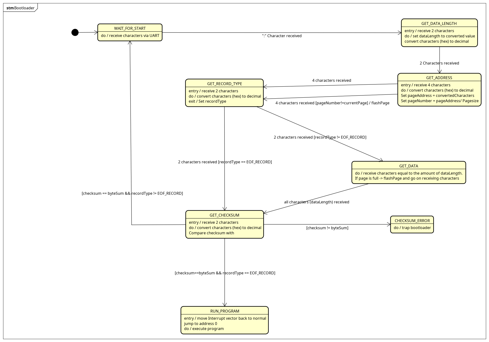

# ArduinoProMiniBootloader

This is the final project of our embedded systems course. It's a bootloader that is able to program the Arduino Pro Mini via the USART and RS232 interface. 

## Building

Just use the included [Makefile](Makefile), it also contains the ability to flash the bootloader to the controller via a USBasp programmer. 

## Dependencies 

This bootloader was build in raw AVR C.

## Statechart

The bootloader is implemented as a state machine. The astah file can be found here: [Statechart](./etc/Bootloader.asta)

## Authors

  - **Fabian Becker**
    [fabibec](https://github.com/fabibec)
  - **Florian Remberger**
    [masterYoda8](https://github.com/masterYoda8)
